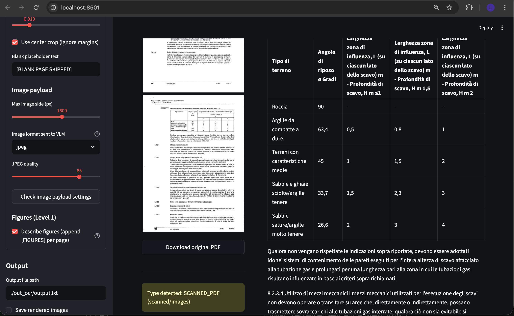

# Multimodal PDF Ingestion for Oracle Vector Search

A practical pipeline to ingest **technical PDFs** into **Oracle Vector Search (Oracle DB 23ai / 26ai)**, handling:

- native text PDFs
- fully scanned PDFs
- mixed/ambiguous PDFs

The repository includes both a **Streamlit UI** and **CLI/Python APIs** for production ingestion workflows.



## What you can do with this project

- Classify each PDF as `TEXT_PDF`, `SCANNED_PDF`, or `MIXED_OR_UNKNOWN`
- Extract text page-by-page with an adaptive strategy:
  - Text PDFs: `Docling` (or `pypdf`)
  - Scanned PDFs: multimodal OCR via OCI GenAI model
  - Mixed PDFs: per-page fallback (`pypdf/Docling` -> OCR when needed)
- Optionally add a `[FIGURES]` section with figure/diagram descriptions per page
- Detect and skip blank pages
- Preserve page provenance in output (`--- PAGE N ---`)
- Convert OCR output into LangChain `Document` objects with stable metadata
- Load chunks into Oracle Vector Search collections
- Inspect and administer collections (list, analyze, delete docs, drop collection)
- Compare OCR outputs against a reference model with optional WER metrics

## Main features

- **Unified extraction pipeline** (`multimodal_extraction/ocr/text_from_pdf_scanner.py`)
- **Robust PDF classifier** (`multimodal_extraction/pdf/classify_pdf.py`)
- **Page-level chunking for RAG** (`multimodal_extraction/chunking/ocr_output_chunking_utils.py`)
- **Oracle Vector Search admin utilities** (`multimodal_extraction/db/oraclevs_admin.py`)
- **Batch ingestion scripts** for new and existing collections (`scripts/ingest/`)
- **Interactive Streamlit app** (`multimodal_extraction/ui/streamlit_app.py`)

## Typical use cases

- RAG on standards, regulations, technical manuals, and engineering documentation
- Corpora containing both digital and scanned PDFs
- Enterprise retrieval pipelines that need page-level provenance and reproducibility

## Repository layout

- `multimodal_extraction/`: core package (OCR, PDF classification, chunking, DB, models, prompts, UI)
- `scripts/ingest/`: operational ingestion scripts
- `scripts/db_admin/`: DB administration scripts
- `scripts/debug/`: debug/inspection utilities
- `docs/`: module-level documentation and setup notes
- `tests/`: unit and integration tests

## Prerequisites

- Python 3.11
- OCI access to Generative AI models
- Oracle DB / Autonomous DB with Vector Search enabled

Install libraries (from `docs/setup_libraries.txt`):

```bash
pip install -U oci oracledb langchain-oci langchain-oracledb
pip install -U langchain-community langchain-core langchain-text-splitters
pip install streamlit streamlit_pdf_viewer pypdfium2 pypdf docling
pip install pytest pytest-cov
```

## Configuration

1. Create `config_private.py` from `config_private_template.py`.
2. Fill DB and OCI values:
   - `VECTOR_DB_USER`, `VECTOR_DB_PWD`, `VECTOR_DSN`
   - wallet fields (`VECTOR_WALLET_DIR`, `VECTOR_WALLET_PWD`) if required
   - `COMPARTMENT_ID`
3. Adjust `multimodal_extraction/config.py` as needed:
   - `REGION`, `SERVICE_ENDPOINT`
   - `MODEL_IDS`, `DEFAULT_MODEL_ID`, `EMBED_MODEL_ID`
   - `DOCKLING_ENABLED`, `ENABLE_MODEL_COMPARISON`

## Quick start

### Run the Streamlit UI

```bash
./start_ocr_ui.sh
```

Alternative:

```bash
PYTHONPATH=$(pwd) python -m streamlit run multimodal_extraction/ui/streamlit_app.py
```

### Classify PDFs in a folder

```bash
python -m multimodal_extraction.pdf.classify_pdf ./data/pdfs --recursive --verbose
```

### OCR/extract one PDF to a text file

```bash
python -m multimodal_extraction.ocr.text_from_pdf_scanner ./data/pdfs/doc1.pdf \
  --model-id openai.gpt-5.2 \
  --text-mode auto \
  --input-pdf-type MIXED_OR_UNKNOWN \
  --describe-figures \
  --out-path ./outputs/doc1_output.txt
```

### Extract a single page (debug)

```bash
python -m scripts.ingest.extract_one_page ./data/pdfs/doc1.pdf 19 --model-id openai.gpt-5.2
```

### First load into a NEW collection

```bash
python -m scripts.ingest.first_loading COLL01 ./data/pdfs --ocr-model-id openai.gpt-5.2
```

### Add new PDFs to an EXISTING collection

```bash
python -m scripts.ingest.add_documents COLL01 ./data/new_pdfs --ocr-model-id openai.gpt-5.2
```

## Python usage examples

### 1) Classify a PDF

```python
from pathlib import Path
from multimodal_extraction.pdf.classify_pdf import ClassifyConfig, classify_pdf

cfg = ClassifyConfig(
    sample_pages=10,
    min_text_chars_doc=200,
    min_text_chars_page=50,
    scanned_if_image_pages_ratio_ge=0.6,
    strong_text_chars=5000,
)

label, reason = classify_pdf(Path("./data/pdfs/doc1.pdf"), cfg)
print(label, reason)
```

### 2) Run OCR pipeline programmatically

```python
from pathlib import Path
from multimodal_extraction.ocr.text_from_pdf_scanner import OcrConfig, run_ocr_pipeline

ocr_cfg = OcrConfig(
    model_id="openai.gpt-5.2",
    out_path=Path("./outputs/doc1_output.txt"),
    text_extraction_mode="auto",  # auto | pypdf | vlm
    input_pdf_type="MIXED_OR_UNKNOWN",
    describe_figures=True,
    image_format="jpeg",          # jpeg | png
    dpi=200,
)

full_text = run_ocr_pipeline(Path("./data/pdfs/doc1.pdf"), ocr_cfg)
print(full_text[:1000])
```

### 3) Convert OCR output to LangChain documents

```python
from pathlib import Path
from multimodal_extraction.chunking.ocr_output_chunking_utils import (
    ocr_output_text_to_chunks,
    chunks_to_langchain_documents,
)

full_text = Path("./outputs/doc1_output.txt").read_text(encoding="utf-8")
chunks = ocr_output_text_to_chunks(full_text, source_name="doc1.pdf", add_header=True)
docs = chunks_to_langchain_documents(chunks)

print(len(docs), docs[0].metadata)
```

### 4) Access Oracle Vector Search admin utilities

```python
from multimodal_extraction.db.db_utils import get_db_connection
from multimodal_extraction.db.oraclevs_admin import OracleVSAdmin

with get_db_connection() as conn:
    print(OracleVSAdmin.list_collections(conn))
    print(OracleVSAdmin.list_documents_with_chunk_counts(conn, "COLL01"))
    print(OracleVSAdmin.analyze_collection(conn, "COLL01"))
```

## Output format and provenance

The OCR pipeline writes one text file with:

- extraction metadata header (`SOURCE PDF`, `MODEL_ID`, `TEXT_MODE`, etc.)
- main body delimited by `BEGIN TEXT` / `END TEXT`
- per-page footer markers: `--- PAGE N ---`

Those markers are used by chunking utilities to preserve source/page provenance.

## Notes on model support

Model availability depends on your OCI region and tenancy permissions.
Configured model IDs are in `multimodal_extraction/config.py`.

## Additional docs

- `docs/text_from_pdf_scanner.md`
- `docs/classify_pdf.md`
- `docs/ocr_output_chunking_utils.md`
- `docs/oraclevs_admin.md`
- `docs/db_utils.md`
- `docs/prompts.md`

## License

MIT. See `LICENSE`.
